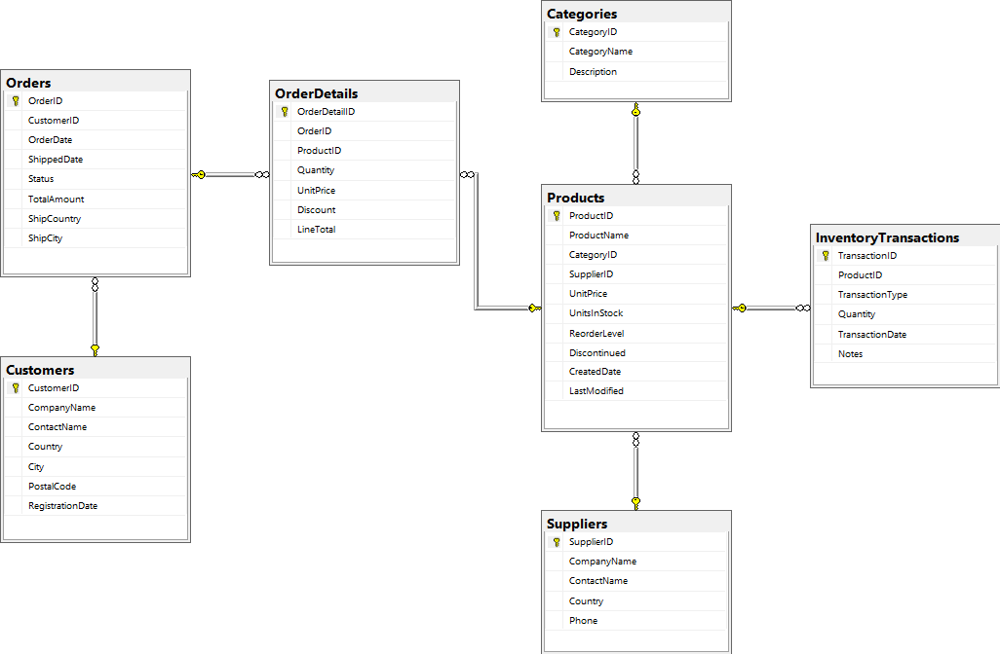
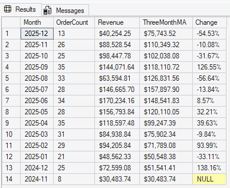
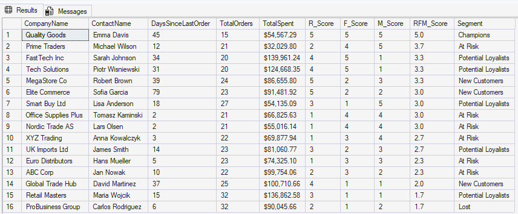

# 📊 Sales Analytics System

> Comprehensive Business Intelligence solution for retail sales analysis using MS SQL Server 2025


---

## 🎯 Project Overview

A production-ready database system designed for analyzing retail sales performance, customer behavior, and inventory management. Built from scratch using advanced SQL techniques including CTEs, Window Functions, and analytical queries.

**Purpose:** Data Analyst portfolio project demonstrating proficiency in database design, complex SQL queries, and business intelligence.

### Key Highlights
- ✅ **7 normalized tables** with referential integrity (3NF)
- ✅ **400 orders** with 1,850+ order details across 13 months
- ✅ **30 products** tracked across 5 categories
- ✅ **16 customers** segmented using RFM methodology
- ✅ **Advanced SQL** - CTEs, Window Functions, Analytical Queries

---

## 🗄️ Database Architecture

### Entity-Relationship Diagram



### Core Tables

| Table | Records | Description |
|-------|---------|-------------|
| **Products** | 30 | Product catalog with pricing and inventory |
| **Categories** | 5 | Product categorization |
| **Suppliers** | 5 | Supplier information |
| **Customers** | 16 | Customer master data |
| **Orders** | 400 | Order headers with status tracking |
| **OrderDetails** | ~1,850 | Order line items with discounts |
| **InventoryTransactions** | 30+ | Inventory movement history |

### Key Relationships
```
Customers 1──▶ N Orders 1──▶ N OrderDetails N ──▶ 1 Products
                                                      │
                                                      ├──▶ 1 Categories
                                                      └──▶ 1 Suppliers
```

---

## 🚀 Advanced SQL Features

### 1. Top Products Analysis
**Complexity:** CTEs + Window Functions  
**Techniques:** ROW_NUMBER(), RANK(), PERCENT_RANK()
```sql
SELECT 
    RevenueRank,
    ProductName,
    FORMAT(TotalRevenue, 'C', 'en-US') AS Revenue,
    FORMAT(RevenuePercentile, 'P2') AS Percentile
FROM vw_TopProducts
ORDER BY RevenueRank;
```

**Business Value:**
- Identifies top 10 products generating 40%+ of total revenue
- Percentile ranking enables data-driven inventory decisions
- Reveals underperforming products for marketing focus


**Key Insights:**
- **Laptop HP Book** dominates with $182K+ revenue (8x more than #2)
- Top 3 products account for 35% of total sales
- Electronics category leads in revenue per unit

---

### 2. Monthly Sales Trend Analysis
**Complexity:** Window Functions + LAG() + Moving Averages  
**Techniques:** ROWS BETWEEN, LAG(), NULLIF(), DATEFROMPARTS()
```sql
SELECT 
    FORMAT(MonthStart, 'yyyy-MM') AS Month,
    FORMAT(MonthlyRevenue, 'C', 'en-US') AS Revenue,
    FORMAT(MovingAvg3Month, 'C', 'en-US') AS ThreeMonthMA,
    FORMAT(PercentChange, 'N2') + '%' AS MoMGrowth
FROM vw_MonthlySalesTrend
ORDER BY MonthStart DESC;
```

**Business Value:**
- 3-month moving average smooths volatility for trend identification
- Month-over-Month growth tracking enables proactive inventory planning
- Detects seasonal patterns and anomalies



**Key Insights:**
- **Q1 2025:** Strong growth (+29% to +53% MoM)
- **April 2025:** Peak revenue month ($214K)
- **Q4 2025:** Declining trend (-16% to -53% MoM) → requires investigation

---

### 3. RFM Customer Segmentation
**Complexity:** NTILE() + CASE Logic + Multi-dimensional Scoring  
**Techniques:** NTILE(5), DATEDIFF(), Complex CASE statements
```sql
SELECT 
    CompanyName,
    FORMAT(TotalSpent, 'C', 'en-US') AS Spent,
    TotalOrders,
    Segment
FROM vw_RFMSegmentation
WHERE Segment IN ('At Risk', 'Lost')
ORDER BY TotalSpent DESC;
```

**RFM Methodology:**
- **Recency (R):** Days since last purchase (lower = better)
- **Frequency (F):** Number of orders (higher = better)
- **Monetary (M):** Total spending (higher = better)

**Business Value:**
- Automated customer segmentation for targeted marketing
- Identifies high-value "At Risk" customers before churn
- Enables personalized retention campaigns



**Key Insights:**
- **0 Champions** (R≥4, F≥4, M≥4) → Opportunity for VIP program
- **2 Loyal Customers** → Focus on upselling
- **2 At Risk** → Immediate retention campaign needed
- **2 Lost** → Win-back strategy with special offers

**Customer Segments:**
| Segment | Count | Action Required |
|---------|-------|-----------------|
| Champions | 0 | Build VIP loyalty program |
| Loyal Customers | 2 | Upsell & cross-sell |
| Potential Loyalists | 8 | Nurture with engagement |
| At Risk | 2 | 🚨 Retention campaign |
| Lost | 2 | 🚨 Win-back offers |

---

## 💡 SQL Techniques Demonstrated

### Window Functions
- `ROW_NUMBER()` - Sequential ranking without ties
- `RANK()` - Ranking with gaps after ties
- `NTILE(n)` - Distribution into n equal buckets
- `PERCENT_RANK()` - Percentile calculation (0.0 to 1.0)
- `LAG()` - Access previous row values
- `ROWS BETWEEN` - Define window frame for aggregations

### Advanced Query Patterns
- **Common Table Expressions (CTEs)** - Multi-level data transformations
- **Subqueries** - Complex filtering logic
- **Computed Columns** - Automatic calculation (LineTotal)
- **Aggregate Functions with OVER** - Partitioned aggregations
- **CASE Statements** - Business logic implementation

### Date & String Functions
- `DATEFROMPARTS()` - Date construction from components
- `DATEDIFF()` - Calculate date differences
- `FORMAT()` - Currency and percentage formatting
- `NULLIF()` - Safe division (avoid divide-by-zero)

### Performance Optimization
- **Indexes** on high-traffic foreign keys
- **Composite indexes** for date + status queries
- **PERSISTED computed columns** for pre-calculated values

---

## 📂 Project Structure
```
SalesAnalytics/
│
├── README.md                          # This file
├── documentation/
│   ├── DATABASE_DESIGN.md             # Technical documentation
│   └── database_diagram.png           # ERD visual
├── sql/
│   ├── 01_schema.sql                  # CREATE TABLE statements
│   ├── 02_sample_data.sql             # INSERT test data
│   ├── 03_views.sql                   # Analytical views
│   └── 04_queries.sql                 # Example queries
└── screenshots/
    ├── top_products.png               # Query results
    ├── monthly_trend.png              # Trend analysis
    └── rfm_segmentation.png           # Customer segments
```

---

## 🛠️ Tech Stack

- **Database:** Microsoft SQL Server 2025 Express
- **IDE:** SQL Server Management Studio (SSMS)
- **Language:** T-SQL (Transact-SQL)
- **Design:** Normalized schema (3NF)
- **Version Control:** Git/GitHub

---

## 💾 Installation & Setup

### Prerequisites
- Windows 10/11
- MS SQL Server 2025 Express ([Download](https://www.microsoft.com/en-us/sql-server/sql-server-downloads))
- SQL Server Management Studio ([Download](https://aka.ms/ssmsfullsetup))

### Quick Start

1. **Clone Repository**
```bash
git clone https://github.com/[your-username]/sales-analytics-system.git
cd sales-analytics-system
```

2. **Create Database**
```sql
-- Run in SSMS
sqlcmd -S localhost -i sql/01_schema.sql
```

3. **Load Sample Data**
```sql
sqlcmd -S localhost -i sql/02_sample_data.sql
```

4. **Create Views**
```sql
sqlcmd -S localhost -i sql/03_views.sql
```

5. **Test Queries**
```sql
-- Verify installation
SELECT COUNT(*) FROM Orders;         -- Should return 400
SELECT COUNT(*) FROM OrderDetails;   -- Should return ~1850
SELECT * FROM vw_TopProducts;        -- Should return Top 10
```

---

## 📊 Sample Data Statistics

| Metric | Value |
|--------|-------|
| **Time Period** | 13 months (Dec 2024 - Dec 2025) |
| **Total Orders** | 400 |
| **Order Details** | 1,850+ line items |
| **Total Revenue** | ~$2.4M |
| **Avg Order Value** | ~$6,000 |
| **Products** | 30 (across 5 categories) |
| **Active Customers** | 16 (8 countries) |
| **Order Completion Rate** | 80% Delivered, 10% Shipped, 5% Pending, 5% Cancelled |

---

## 🎓 Skills Demonstrated

### Database Design
✅ Entity-Relationship modeling  
✅ Normalization (3NF) to eliminate redundancy  
✅ Foreign key constraints for referential integrity  
✅ Strategic index placement for performance  

### SQL Proficiency
✅ Complex multi-table JOINs (INNER, LEFT)  
✅ Common Table Expressions (CTEs) for readability  
✅ Window Functions for analytical queries  
✅ Aggregate functions with OVER clause  
✅ Date manipulation and formatting  

### Business Analysis
✅ Sales forecasting with moving averages  
✅ Customer segmentation (RFM methodology)  
✅ Product performance ranking  
✅ Trend identification and anomaly detection  

---


